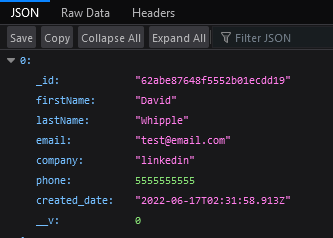

# RESTful web API with NodeJS and Express

## Back End Application

[LinkedIn course](https://www.linkedin.com/learning/building-restful-apis-with-node-js-and-express/install-node-and-express?autoSkip=true&autoplay=true&resume=false)

## Purpose

Express Routes have given me some difficulty in the past so I've decided to take this course to better understand RESTful APIs with NodeJS and Express. This course also includes some MongoDB and Mongoose which is always a plus.

## Author

This course is taught by [Emmanuel Henri](https://www.linkedin.com/learning/instructors/emmanuel-henri) on LinkedIn Learning.

## Badges

